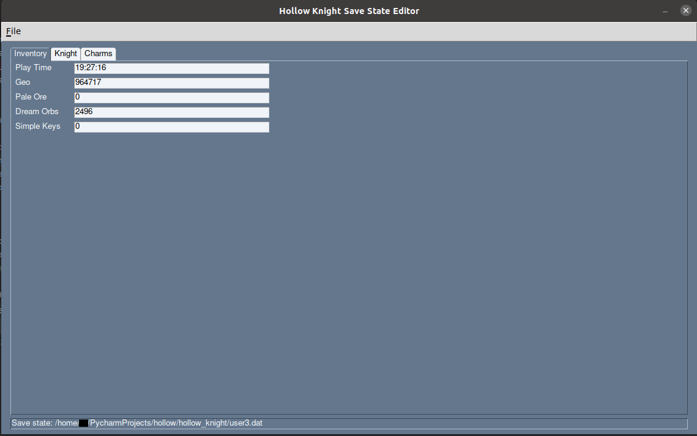
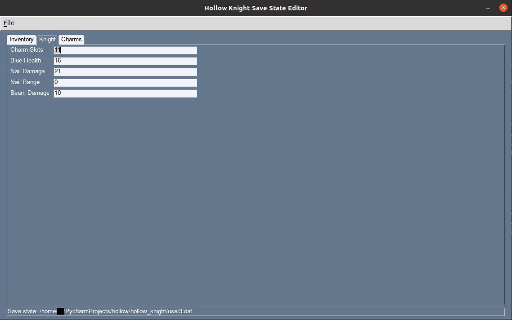
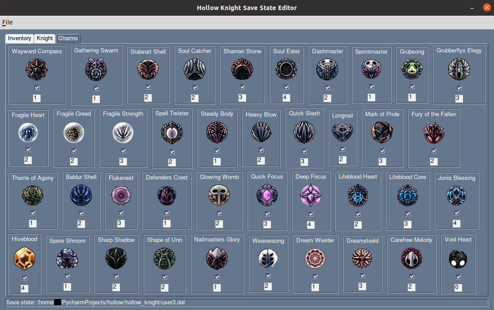

# Hollow Knight Save State Editor for Nintendo Switch

A small project of mine I started for fun. Once you export your save state with Checkpoint, EdiZon, etc. you can open 
the `user*.dat` with this Save State Editor and change some properties.

To start use `File -> Open` to choose your save state. I recommend creating a backup before start editing. You can 
create a backup manually or use `File -> Create Backup` after choose your save state.

## Inventory Properties
In the first tab you can change inventory properties as shown in below screenshot:

## Hollow Knight Properties
In the second tab you can change character specific properties as shown in below screenshot:

## Charms Properties
In the third tab you can modify charms properties. As displayed in below Screenshot you can 
check/uncheck a charm to give or remove it. The number below each charm specifies 
the number of slots a charm consumes.

# Bugs
If you find any bugs be free to create an issue. Thank you!

# Further Properties
I plan to even more properties to manipulate in the future. 